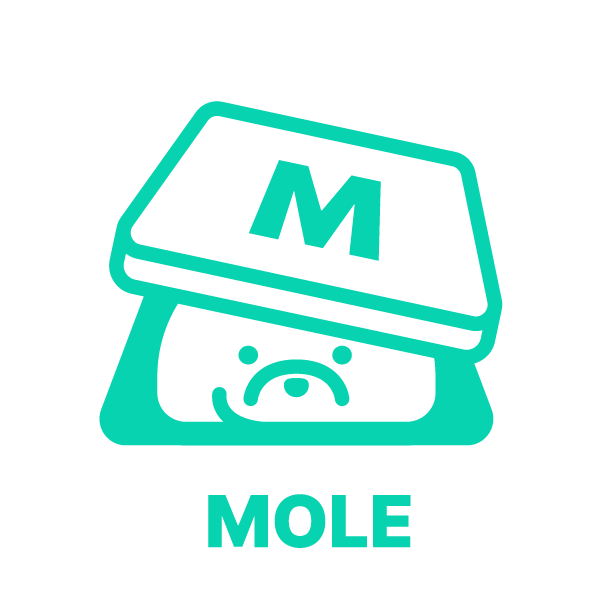

# mole-virtual-keyboard




한글 입력이 가능한 웹 전용 가상 키보드입니다.

## DEMO


[Link](https://x42ky.csb.app/)

## Installation

```
npm install mole-virtual-keyboard
```

```
yarn add mole-virtual-keyboard
```

## Sample Code

```ts
import { HangulImeInputWrapper } from "mole-virtual-keyboard";
import { useEffect, useRef } from "react";

let inputWrapper: HangulImeInputWrapper | undefined = undefined;

export default function App() {
  const inputRef = useRef<HTMLInputElement>(null);

  useEffect(() => {
    if (!inputRef.current) return;
    inputWrapper = new HangulImeInputWrapper(inputRef.current);
  }, []);

  return (
    <div className="App">
      <div>
        <span>입력 : </span>
        <input
          ref={inputRef}
          type="text"
          style={{
            fontSize: "1.5rem",
          }}
          onSelect={() => {
            inputWrapper?.checkChangedSelect();
          }}
        />
      </div>
      <div>
        {"ㄱㄲㄴㄷㄸㄹㅁㅂㅃㅅㅆㅇㅈㅉㅊㅋㅌㅍㅎ".split("").map((val, idx) => {
          return (
            <button
              key={idx}
              onClick={() => {
                inputWrapper?.insert(val);
              }}
            >
              {val}
            </button>
          );
        })}
      </div>
    </div>
  );
}
```

## Related Link

- [Mole Virtual Keyboard](https://github.com/huinalam/mole-virtual-keyboard)
- [Hangul IME](https://github.com/huinalam/hangul-ime)
- [NPM Package](https://www.npmjs.com/package/mole-virtual-keyboard)
