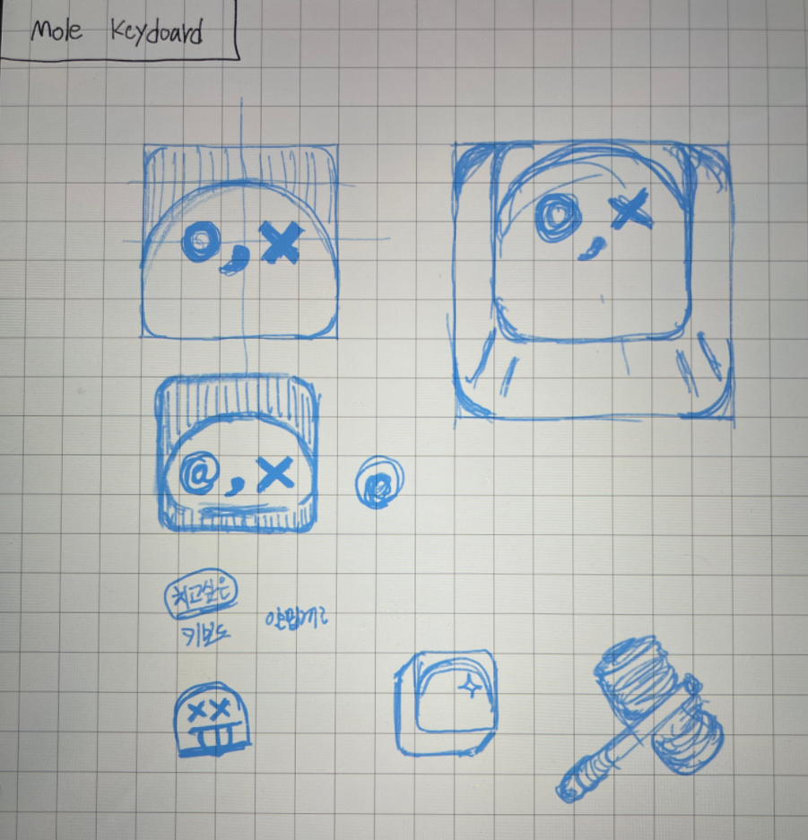
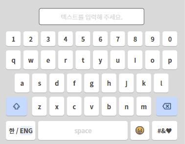

# mole-virtual-keyboard



## 설명

한글 입력이 가능한 웹 전용 가상 키보드입니다. 한글 입력 뿐만 아니라, 이모지와 영어 입력을 지원합니다. input에서의 커서를 이동하더라도 키보드 입력이 가능합니다.

## DEMO



[Link](https://x42ky.csb.app/)

## Installation

```
npm install mole-virtual-keyboard
```

```
yarn add mole-virtual-keyboard
```

## Sample Code

### API 예제

```ts
const input = document.createElement("input");
const inputWrapper = new HangulImeInputWrapper(input);

inputWrapper.insert("ㄱ");
inputWrapper.insert("ㅏ");
inputWrapper.insert("ㄱ");
inputWrapper.insert("ㄱ");
inputWrapper.insert(" ");
inputWrapper.insert("😀");
inputWrapper.insert("a");
inputWrapper.insert("b");
inputWrapper.insert("c");
inputWrapper.backspace();

console.log(input.value);
// output : "각ㄱ 😀ab"
```

### input 적용 예제

```ts
import { HangulImeInputWrapper } from "mole-virtual-keyboard";
import { useEffect, useRef } from "react";

let inputWrapper: HangulImeInputWrapper | undefined = undefined;

export default function App() {
  const inputRef = useRef<HTMLInputElement>(null);

  useEffect(() => {
    if (!inputRef.current) return;
    inputWrapper = new HangulImeInputWrapper(inputRef.current);
  }, []);

  return (
    <div className="App">
      <div>
        <span>입력 : </span>
        <input
          ref={inputRef}
          type="text"
          onSelect={() => {
            inputWrapper?.checkChangedSelect();
          }}
        />
      </div>
      <div>
        {"ㄱㄲㄴㄷㄸㄹㅁㅂㅃㅅㅆㅇㅈㅉㅊㅋㅌㅍㅎ".split("").map((val, idx) => {
          return (
            <button
              key={idx}
              onClick={() => {
                inputWrapper?.insert(val);
              }}
            >
              {val}
            </button>
          );
        })}
        <button
          onClick={() => {
            inputWrapper?.insert(" ");
          }}
        >
          space
        </button>
        <button
          onClick={() => {
            inputWrapper?.backspace();
          }}
        >
          backspace
        </button>
      </div>
    </div>
  );
}
```

## Related Link

- [Mole Virtual Keyboard](https://github.com/huinalam/mole-virtual-keyboard)
- [Hangul IME](https://github.com/huinalam/hangul-ime)
